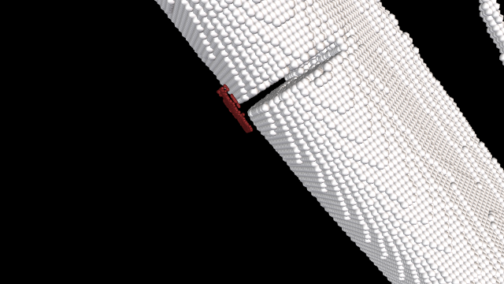

## Examples

Here we present results of various types of Timothy simulations. 

<ol>
<li><b>Simple example of cellular colony dynamics</b> 
<iframe src="https://player.vimeo.com/video/121722431" width="480" height="360" frameborder="0" webkitallowfullscreen mozallowfullscreen allowfullscreen></iframe> 
<a href="https://vimeo.com/121722431">Timothy</a> from <a href="https://vimeo.com/user7149826">ICM HPC</a> on <a href="https://vimeo.com">Vimeo</a>.

</li>
  
<li><b>Vessel with concentration gradient of oxygen in the surrounding tissue</b> 
<a href="images/oxyvessel.png"></img></a></li>
  
<li><b>2-D mitosis example</b> 
<iframe src="https://player.vimeo.com/video/121765695" width="480" height="339" frameborder="0" webkitallowfullscreen mozallowfullscreen allowfullscreen></iframe> 
<a href="https://vimeo.com/121765695">2-D mitosis</a> from <a href="https://vimeo.com/user7149826">ICM HPC</a> on <a href="https://vimeo.com">Vimeo</a>.

</li>
  
<li><b>3-D solid tumor development within healthy tissue (106 cells)</b> 
<iframe src="https://player.vimeo.com/video/121765693" width="480" height="269" frameborder="0" webkitallowfullscreen mozallowfullscreen allowfullscreen></iframe> 
<a href="https://vimeo.com/121765693">3-D tumor spheroid</a> from <a href="https://vimeo.com/user7149826">ICM HPC</a> on <a href="https://vimeo.com">Vimeo</a>.
 
<a href="images/tumor.png"></img></a>
</li>
  
<li><b>3-D solic tumor development in oxygen environment (necrotic core)</b> 
<iframe src="https://player.vimeo.com/video/121765694" width="480" height="360" frameborder="0" webkitallowfullscreen mozallowfullscreen allowfullscreen></iframe> 
<a href="https://vimeo.com/121765694">Necrotic core</a> from <a href="https://vimeo.com/user7149826">ICM HPC</a> on <a href="https://vimeo.com">Vimeo</a>.
 
<a href="images/necrotic.png"></img></a>
</li>
  
<li><b>Large scale tissue simulation</b> 
<a href="images/tissue.png"></img></a>
</li>
  
<li><b>Bone stem cells treatments for bone regeneration</b> 
<a href="images/bone1.png"></img></a>
<a href="images/bone2.png"></img></a>
 
<a href="images/bone3.png"></img></a>
<a href="images/bone4.png"></img></a>
</li>
</ol>

